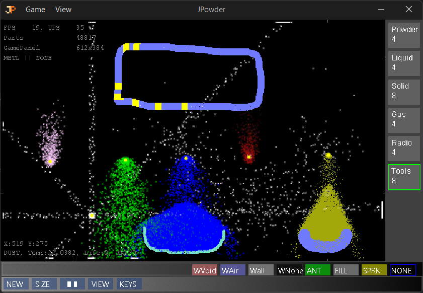

# JPowder

A java cellular automata based on The Powder Toy.

Thread located at [powdertoy.co.uk](http://powdertoy.co.uk/Discussions/Thread/View.html?Thread=19989&PageNum=0)



| Control | Action                                         |
|---------|------------------------------------------------|
| T       | Toggle drawing shape as Circle or Square.      |
| F       | Update by a single frame.                      |
| H       | Toggle HUD                                     |
| S       | Toggle window size.                            |
| SPACE   | Pause & Play                                   |
| [ ]     | Change drawing size +- 1                       |
| 1 to 4  | View type: Default, Temp, Life Gradient, Fancy |
 
### Build & Run

Use the clean build commands to test a build. Use the run command to build and run.

```sh
$ ./gradlew clean build
$ ./gradlew run
```

### Package

Run the package command then zip up the `build/package` folder contents for a release.

```sh
$ ./gradlew packageJar
```